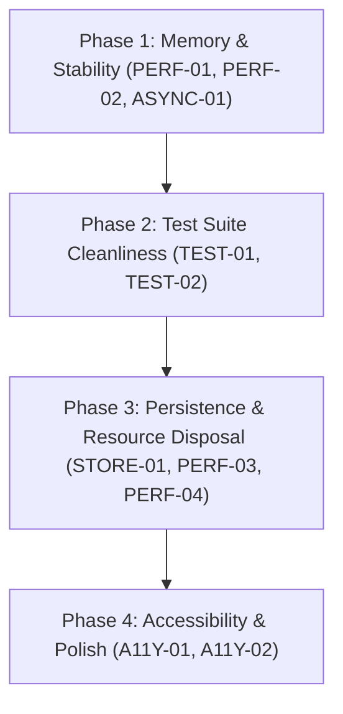

# Code Review Action Items — jchess ♟️

## Executive Summary

A comprehensive code review of **jchess** was performed across the codebase covering architecture, 3D graphics performance (Three.js), engine communication (Stockfish WASM), state management (Zustand), testing (Vitest, React Testing Library), storage (IndexedDB), and accessibility (a11y).

Overall, **jchess** demonstrates clean design, impressive voxel rendering, robust chess rules (via `chessops`), and smooth 130ms animation physics. However, several critical performance bottlenecks (material/geometry allocation churn), async race conditions during engine thinking delays, missing test setup wrappers, and accessibility gaps were identified.

---

## Action Items Matrix

| ID | Category | Item | Severity | Location |
|---|---|---|---|---|
| **PERF-01** | Performance | Material Churn in Voxel Explosion Debris | 🔴 High | [debris.ts](file:///Users/spencerjireh/git/jchess/src/render/animation/debris.ts#L67-L125) |
| **PERF-02** | Memory | Un-disposed Shadow Plane Geometries in Piece Manager | 🔴 High | [pieces.ts](file:///Users/spencerjireh/git/jchess/src/render/pieces.ts#L173-L178) |
| **PERF-03** | Memory | Incomplete Resource Disposal on Theme Switch | 🟡 Medium | [index.ts](file:///Users/spencerjireh/git/jchess/src/render/index.ts#L416-L427) |
| **PERF-04** | Performance | Un-cancelled `requestAnimationFrame` Loops on Board Resize | 🟡 Medium | [index.ts](file:///Users/spencerjireh/git/jchess/src/render/index.ts#L140-L147) |
| **ASYNC-01** | Concurrency | Un-cancellable Think Delay Causes Stale Engine Move Execution | 🔴 High | [controller.ts](file:///Users/spencerjireh/git/jchess/src/store/controller.ts#L212-L223) |
| **ASYNC-02** | Concurrency | Engine Search Cancellation Overwrites New Game / Takeback State | 🟡 Medium | [controller.ts](file:///Users/spencerjireh/git/jchess/src/store/controller.ts#L224-L232) |
| **STORE-01** | Persistence | Risk of Game State Loss on Tab Closure (500ms Debounce) | 🟡 Medium | [index.ts](file:///Users/spencerjireh/git/jchess/src/storage/index.ts#L35-L56) |
| **TEST-01** | Testing | React `act()` Warnings in Integration Test Suite | 🔴 High | [ui-components.test.tsx](file:///Users/spencerjireh/git/jchess/tests/integration/ui-components.test.tsx#L121-L125) |
| **TEST-02** | Tooling | Missing ESLint Configuration & Script in `package.json` | 🟡 Medium | [package.json](file:///Users/spencerjireh/git/jchess/package.json#L15-L16) |
| **TEST-03** | Testing | WebGL Context Stderr Error Output During Vitest Runs | 🟢 Low | [ui-components.test.tsx](file:///Users/spencerjireh/git/jchess/tests/integration/ui-components.test.tsx#L1-L127) |
| **A11Y-01** | Accessibility | Missing ARIA Live Region for Move & Game Announcements | 🟡 Medium | [StatusBar.tsx](file:///Users/spencerjireh/git/jchess/src/ui/StatusBar.tsx#L43-L67) |
| **A11Y-02** | Accessibility | Incomplete ARIA State Attributes in Difficulty Selector | 🟢 Low | [DifficultyPicker.tsx](file:///Users/spencerjireh/git/jchess/src/ui/DifficultyPicker.tsx#L119-L158) |

---

## Detailed Action Items & Remediation Plans

### 1. Performance & Memory Management

> [!IMPORTANT]
> **PERF-01: Re-use Shard & Spark Materials in Debris Manager**
> - **Problem**: `spawnExplosion()` in [debris.ts](file:///Users/spencerjireh/git/jchess/src/render/animation/debris.ts#L67-L125) instantiates a new `THREE.MeshLambertMaterial` for every single shard (32/explosion) and `THREE.MeshBasicMaterial` for every spark (18/explosion). This creates 50 material allocations per capture event, triggering heavy WebGL state changes and Garbage Collection (GC) pauses.
> - **Remediation**: Cache and re-use a palette material pool or adjust material opacity dynamically on shared materials.

> [!CAUTION]
> **PERF-02: Fix Un-disposed Shadow Plane Geometries**
> - **Problem**: Inside `PieceManager.updatePosition()` in [pieces.ts](file:///Users/spencerjireh/git/jchess/src/render/pieces.ts#L173-L178), `const shadowGeo = new THREE.PlaneGeometry(0.85, 0.85)` is instantiated for every newly spawned piece. When pieces are captured or removed via `removePiece()`, `shadowQuad.geometry` is never disposed, causing a memory leak over long games.
> - **Remediation**: Re-use a single shared `shadowGeo` instance stored on `PieceManager` (similar to how `shadowMaterial` is shared).

> [!NOTE]
> **PERF-03: Complete Resource Disposal on Theme Switch**
> - **Problem**: `Renderer.setTheme()` in [index.ts](file:///Users/spencerjireh/git/jchess/src/render/index.ts#L416-L427) disposes the board mesh geometry, but old materials in `PieceManager` and `OverlayManager` are retained in GPU memory.
> - **Remediation**: Call explicit material `.dispose()` methods when regenerating geometry and material caches during theme updates.

> [!NOTE]
> **PERF-04: Safeguard Board Resize Animation Frame Loop**
> - **Problem**: In [index.ts](file:///Users/spencerjireh/git/jchess/src/render/index.ts#L140-L147), changing board size spawns a recursive `requestAnimationFrame` loop that runs 15 frames. Rapid size toggling spawns overlapping RAF loops without cancellation handles.
> - **Remediation**: Store the active resize animation RAF handle and cancel any existing loop before scheduling a new resize animation.

---

### 2. Concurrency & Async Race Conditions

> [!WARNING]
> **ASYNC-01: Cancel Artificial Think Delays on State Transition**
> - **Problem**: In `GameController.triggerEngineSearch()` in [controller.ts](file:///Users/spencerjireh/git/jchess/src/store/controller.ts#L212-L223), engine moves are delayed using `await new Promise((r) => setTimeout(r, delayMs))`. If the user clicks **Takeback** or **New Game** while `kind === "engine-delaying"`, the delay finishes and executes `this.applyEngineMove(parsedMove)`, applying an invalid move to a new or rolled-back game state!
> - **Remediation**: Use an `AbortController` or check `this.state.status.kind === "engine-delaying"` immediately before calling `applyEngineMove()`.

> [!NOTE]
> **ASYNC-02: Guard Engine Search Error Handler**
> - **Problem**: If `startNewGame()` or `takeback()` interrupts an in-flight engine search, `engine.search()` rejects with `"Search cancelled by new search"`. The catch block in [controller.ts](file:///Users/spencerjireh/git/jchess/src/store/controller.ts#L224-L232) catches this error and sets `status: { kind: "error" }`, overwriting the clean new game status.
> - **Remediation**: Ignore cancellation errors in `triggerEngineSearch()` when status is no longer `"engine-thinking"`.

> [!NOTE]
> **STORE-01: Flush Unsaved Game State on Window Unload**
> - **Problem**: `saveActiveGame()` in [storage/index.ts](file:///Users/spencerjireh/git/jchess/src/storage/index.ts#L35-L56) uses a 500ms debounce timer. If the user makes a move and immediately closes the tab or reloads, the latest move is lost.
> - **Remediation**: Add a `visibilitychange` / `beforeunload` event listener that immediately executes any pending `saveActiveGame` write.

---

### 3. Test Pipeline & Quality Assurance

> [!IMPORTANT]
> **TEST-01: Wrap Asynchronous Engine Initialization in Integration Tests**
> - **Problem**: `tests/integration/ui-components.test.tsx` emits 5 React `act(...)` warnings during `npm test`. In `App.tsx`, `engine.init().then(() => ctrl.startNewGame())` triggers asynchronous state updates after test rendering finishes.
> - **Remediation**: In `ui-components.test.tsx`, wrap test mounts in `act(async () => { ... })` or mock `engine.init()` to resolve synchronously in test environments.

> [!NOTE]
> **TEST-02: Configure ESLint Script in `package.json`**
> - **Problem**: `package.json` includes `eslint` and `typescript-eslint` in `devDependencies`, but `"npm run lint"` only runs `"tsc --noEmit"`.
> - **Remediation**: Add an `eslint.config.js` file and update `"lint"` script to `"tsc --noEmit && eslint src/ tests/"`.

---

### 4. Accessibility (a11y) & UX

> [!TIP]
> **A11Y-01: Add ARIA Live Region for Game Events**
> - **Problem**: When playing moves, check/checkmate occur, or engine responds, screen reader users receive no spoken feedback.
> - **Remediation**: Add an `aria-live="polite"` region to `StatusBar.tsx` in [StatusBar.tsx](file:///Users/spencerjireh/git/jchess/src/ui/StatusBar.tsx#L43-L67) to announce SAN moves and game outcomes.

> [!TIP]
> **A11Y-02: Add ARIA Pressed & Selected States to Difficulty Controls**
> - **Problem**: In [DifficultyPicker.tsx](file:///Users/spencerjireh/git/jchess/src/ui/DifficultyPicker.tsx#L119-L158), level selection buttons in the expanded view lack `aria-pressed` / `aria-selected` attributes.
> - **Remediation**: Add `aria-pressed={isSelected}` to each expanded difficulty button.

---

## Suggested Implementation Roadmap

